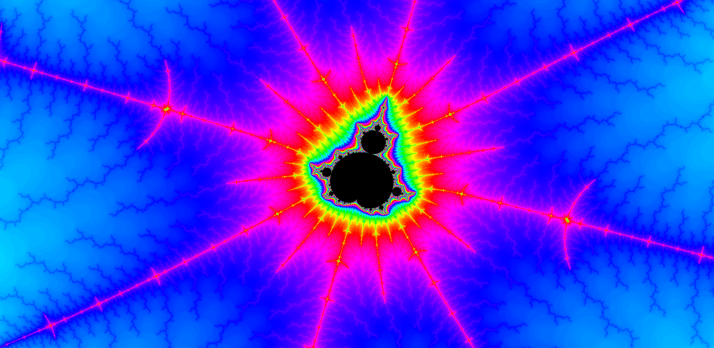

# Megafractal

## Description

A toy project to play with the Mandelbrot set and Rust.

## The (original) goal

- to parallelize the execution so that each pixel computation can be shared among executors
- code executors in Rust

## Project status

The main problems with the project are the latency and bandwidth required to stream Mandelbrot set pixels to the user. Maybe a little bit more of architecture planning would have helped.

## How to run?

The static files for the browser can be found on `./front`. Personally, I just used `npx serve .` to host them.

The Rust backend can be found on `./rust-executor`. You can run it with `cargo r --release`.

Software works only on localhost.
